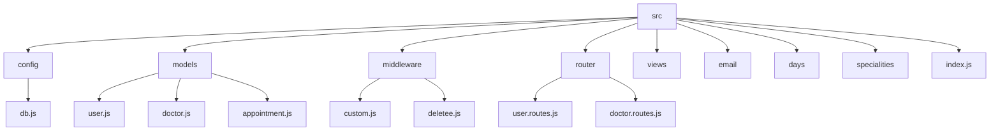

# Doctor Finder: Connecting Patients with the Right Doctors 🌟


## 🗂️ Description

Doctor Finder is a web application designed to bridge the gap between patients and healthcare professionals. It allows users to find and book appointments with suitable doctors based on their symptoms, specialty, and availability. The platform aims to streamline the process of seeking medical care, making it more efficient and accessible for both patients and doctors.

## ✨ Key Features

### **User Features** 🌟
- **Symptom Checker**: Users can describe their symptoms and find relevant doctors.
- **Doctor Listings**: Browse through a list of available doctors, filterable by specialty, location, and more.
- **Appointment Booking**: Schedule appointments with chosen doctors.
- **Profile Management**: Users can manage their profiles, including updating personal details.

### **Doctor Features** 💼
- **Profile Creation**: Doctors can create profiles showcasing their specialty, experience, and availability.
- **Appointment Management**: View and manage scheduled appointments.
- **Profile Editing**: Update profile information, including specialty, clinic details, and availability.

## 🗂️ Folder Structure



## 🛠️ Tech Stack


## ⚙️ Setup Instructions

1. **Clone the Repository**:
   ```bash
   git clone https://github.com/amitdey43/Doctor-Finder.git
   ```
2. **Install Dependencies**:
   ```bash
   cd Doctor-Finder
   npm install
   ```
3. **Environment Setup**:
   - Create a `.env` file in the root directory and add your MongoDB connection string and other environment variables.
   ```plaintext
   DB_CONNECTION_STRING=your_mongodb_connection_string
   ```
4. **Start the Server**:
   ```bash
   npm start
   ```
5. **Access the Application**:
   - Open your web browser and navigate to `http://localhost:3000`.

## 🤖 GitHub Actions

This project utilizes GitHub Actions for continuous integration and deployment. The workflow is defined in the `.github/workflows/main.yml` file and includes steps for:

- **Checkout Code**: Checks out the repository code.
- **Install Dependencies**: Installs project dependencies.
- **Run Tests**: Executes tests (if implemented).
- **Deploy to Production**: Deploys the application to a production environment.

```yml
name: Main Workflow

on:
  push:
    branches:
      - main

jobs:
  build-and-deploy:
    runs-on: ubuntu-latest
    steps:
      - name: Checkout code
        uses: actions/checkout@v2

      - name: Install dependencies
        run: npm install

      - name: Build and deploy
        run: npm start
```

## 📝 Known Issues and Future Enhancements

- **Symptom Checker Accuracy**: Enhance the symptom checker algorithm for more accurate doctor recommendations.
- **User Authentication**: Implement more robust authentication mechanisms, including two-factor authentication.
- **Payment Gateway Integration**: Integrate a secure payment gateway for appointment bookings.


<br><br>
<div align="center">

<h3>null</h3>
<p>No information provided.</p>
</div>
<br>
<p align="right">
  <a href="https://gitfull.vercel.app">Made by GitFull</a>
</p>
    