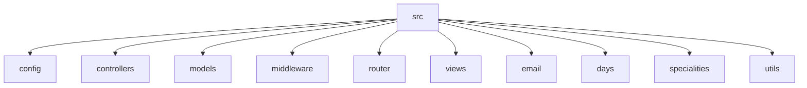

# Doctor Finder

## 🗂️ Description

Doctor Finder is a web application designed to connect patients with doctors. The platform allows users to search for doctors based on their symptoms, book appointments, and manage their appointments. Doctors can create profiles, manage their appointments, and interact with patients. The application uses a robust tech stack to ensure a seamless user experience.

The application is built with a focus on simplicity, scalability, and maintainability. It uses a microservices architecture, with separate modules for user management, doctor management, appointment management, and email services.

## ✨ Key Features

### **User Features**

*   **Symptom Checker**: Users can describe their symptoms and find suitable doctors.
*   **Doctor Search**: Users can search for doctors based on their location, specialty, and availability.
*   **Appointment Booking**: Users can book appointments with doctors.
*   **Appointment Management**: Users can view and manage their appointments.

### **Doctor Features**

*   **Profile Management**: Doctors can create and manage their profiles.
*   **Appointment Management**: Doctors can view and manage their appointments.
*   **Patient Interaction**: Doctors can interact with patients through the platform.

### **Admin Features**

*   **User Management**: Admins can manage user accounts.
*   **Doctor Management**: Admins can manage doctor accounts.

## 🗂️ Folder Structure



## 🛠️ Tech Stack


## ⚙️ Setup Instructions

### **Prerequisites**

*   Node.js (version 16 or higher)
*   MongoDB (version 5 or higher)
*   A code editor or IDE

### **Installation**

1.  Clone the repository: `git clone https://github.com/amitdey43/Doctor-Finder.git`
2.  Navigate to the project directory: `cd Doctor-Finder`
3.  Install dependencies: `npm install`
4.  Create a `.env` file and add your environment variables:
    *   `MONGO_URI`: Your MongoDB connection string
    *   `EMAIL`: Your email address
    *   `PASSWORD`: Your email password
5.  Start the server: `npm start`

## 🚀 GitHub Actions

The repository uses GitHub Actions for continuous integration and deployment. The workflow is defined in the `.github/workflows/main.yml` file.

```yml
name: Node.js CI

on:
  push:
    branches: [ main ]

jobs:
  build:

    runs-on: ubuntu-latest

    steps:
    - uses: actions/checkout@v2
    - name: Use Node.js 16
      uses: actions/setup-node@v2
      with:
        node-version: '16'
    - run: npm install
    - run: npm run test
    - run: npm run build
```

## 📝 Commit Messages

Commit messages should follow the standard format:

`fix: <description>`

`feat: <description>`

`docs: <description>`

`style: <description>`

`refactor: <description>`

`perf: <description>`

`test: <description>`

`build: <description>`

`ci: <description>`

`chore: <description>`


<br><br>
<div align="center">

<h3>Amit kumar dey </h3>
<p>Developer interested in coding.</p>
</div>
<br>
<p align="right">
  <a href="https://gitfull.vercel.app">Made by GitFull</a>
</p>
    