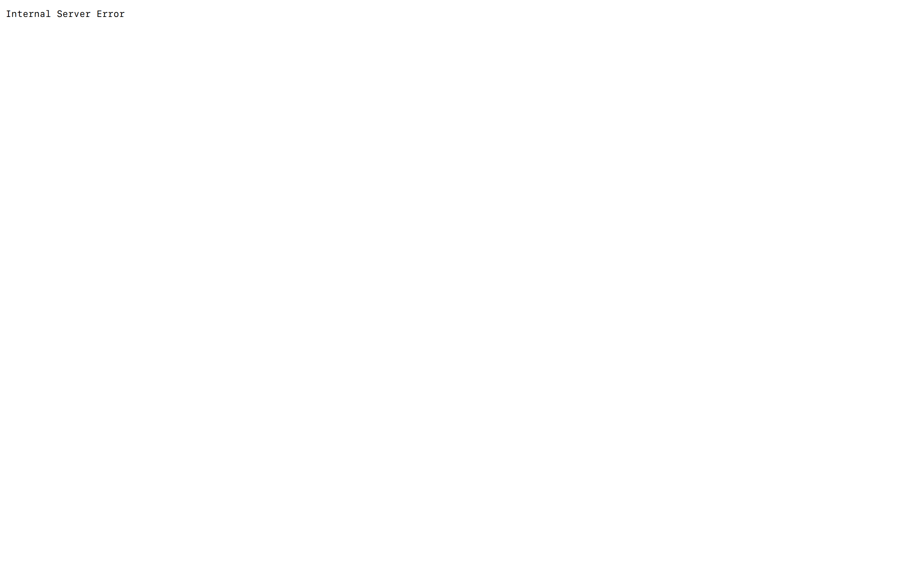

# Doctor Finder: Connecting Patients with the Right Doctors 🧬


## 🗂️ Description

Doctor Finder is a web application designed to connect patients with suitable doctors based on their symptoms and medical needs. The platform allows users to describe their symptoms, find relevant doctors, and book appointments seamlessly. It also provides doctors with a panel to manage their profiles, view appointments, and interact with patients. Built with Express.js, MongoDB, and EJS templating, Doctor Finder aims to streamline the process of finding and booking medical appointments.

## ✨ Key Features

### **User Features** 🌟
- **Symptom Checker**: Users can describe their symptoms and find doctors with relevant specialties.
- **Appointment Booking**: Users can book appointments with doctors directly through the platform.
- **Profile Management**: Users can manage their profiles, including updating personal details.

### **Doctor Features** 👨‍⚕️
- **Profile Creation**: Doctors can create profiles, including details like specialty, clinic, and availability.
- **Appointment Management**: Doctors can view and manage their appointments.
- **Edit Profile**: Doctors can update their profile information.

### **Core Features** 🔥
- **Authentication**: Secure login and registration for both users and doctors.
- **Email Notifications**: Automated email notifications for appointment confirmations and updates.

## 🗂️ Folder Structure


## 🛠️ Tech Stack


## ⚙️ Setup Instructions

1. **Clone the Repository**:
   ```bash
   git clone https://github.com/amitdey43/Doctor-Finder.git
   ```
2. **Install Dependencies**:
   ```bash
   cd Doctor-Finder
   npm install
   ```
3. **Environment Variables**:
   - Create a `.env` file in the root directory.
   - Add your MongoDB connection string: `mongodburl="your-mongodb-connection-string"`
   - Add your email credentials for Nodemailer: `EMAIL="your-email@gmail.com"` and `PASSWORD="your-email-password"`

4. **Start the Application**:
   ```bash
   npm start
   ```

## 🤖 GitHub Actions

This project utilizes GitHub Actions for continuous integration and deployment. The workflow is defined in `.github/workflows/main.yml` and includes steps for:

- Checkout code
- Install dependencies
- Run tests (if implemented)
- Deploy to Vercel

```yml
name: Main Workflow

on:
  push:
    branches:
      - main

jobs:
  build-and-deploy:
    runs-on: ubuntu-latest
    steps:
      - name: Checkout code
        uses: actions/checkout@v2

      - name: Install dependencies
        run: npm install

      - name: Build and deploy
        env:
          VERCEL_TOKEN: ${{ secrets.VERCEL_TOKEN }}
        run: |
          npm run build
          vercel deploy --prod
```


<br><br>
<div align="center">

<h3>null</h3>
<p>No information provided.</p>
</div>
<br>
<p align="right">
  <a href="https://gitfull.vercel.app">Made by GitFull</a>
</p>
    